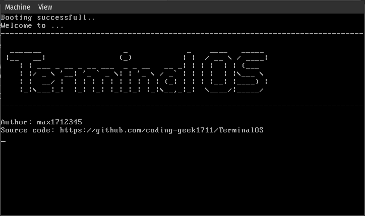
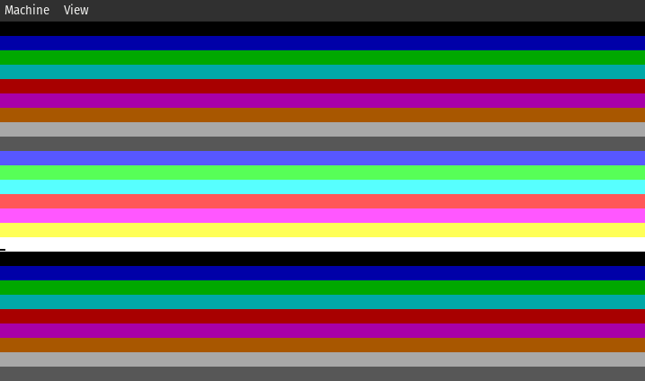

```
  _______                  _             _    ____   _____ 
 |__   __|                (_)           | |  / __ \ / ____|
    | | ___ _ __ _ __ ___  _ _ __   __ _| | | |  | | (___  
    | |/ _ \ '__| '_ ` _ \| | '_ \ / _` | | | |  | |\___ \ 
    | |  __/ |  | | | | | | | | | | (_| | | | |__| |____) |
    |_|\___|_|  |_| |_| |_|_|_| |_|\__,_|_|  \____/|_____/

```
- This is a barebones 32 bit operating system written completely from scratch.


## Useful functions

- nasm boot/bootsector.asm -f bin -o bin/boot.bin
- gcc -ffreestanding -c kernel/kernel.c -o kernel/kernel.o
- ld -o bin/kernel.bin -Ttext 0x1000 kernel/kernel.o --oformat binary
- cat bin/boot.bin bin/kernel.bin > os-image.bin
- qemu-system-i386 -hda os-image.bin

## When c is used

### Obsolete
### NOTE: Check makefile for new compilation commands

- nasm boot/bootsector.asm -f bin -o bin/boot.bin
- gcc -ffreestanding  -m32 -c kernel.c -o kernel.o
- nasm  -f elf32 -o kernel_entry.o kernel_entry.asm 
- ld -m elf_i386 -Ttext 0x1000 -o kernel.bin kernel_entry.o kernel.o
- cat bin/boot.bin kernel/kernel.bin > os-image.bin

## dissassmeble
- ndisasm -b 32 basic.bin > basic.dis


## What all is done?
- Basic bootsector is written which can bootstrap our qemu based system to load into 32 bit protected mode
- C based compilation and linking scripts are done
- A real basic VGA driver which can clear the screen and print lines onto the screen are implemented
- Cursor movement is finished
- Color setting using driver functions are enabled, both foreground and background. Uses standard VGA color values
- Boot screen is finished, ASCII ART based logo looks good
- Make file built to automate build process
- switched to an i386 compatible cross compiler
- Scroll
- Keyboard IO complete
  (How idt works and PIC remapping part is still a bit sketchy but it works)

## What is to be done?
- Nasty linking bug which explodes binary size to > 130mb ==> fixed but can operate only in fda mode  ==> Fixed
- Follow [here](https://github.com/cfenollosa/os-tutorial/blob/master/13-kernel-barebones/Makefile) for solution    (linking bug)

- Fix found for fda mode only, issue was osimage being too small for 15 sectors to read, so qemu-resize os image to a minimum of 20kb
[here](https://stackoverflow.com/a/58679202)

 


